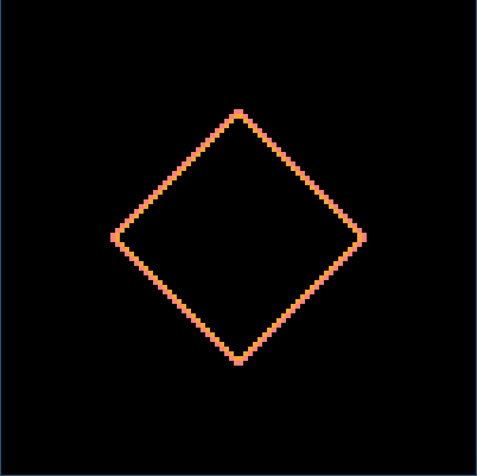

# Rucomato

[](https://github.com/torlenor/rucomato/actions/workflows/rust.yml)

## Description

An implementation of different [cellular automata](https://en.wikipedia.org/wiki/Cellular_automaton) in Rust.

## Requirements

- [Rust](https://www.rust-lang.org/)
- libsdl2
  ```console
  sudo apt install libsdl2-dev libsdl2-gfx-dev libsdl2-image-dev libsdl2-mixer-dev libsdl2-net-dev libsdl2-ttf-dev
  ```

## Basic functionality

- Press "p" to pause the simulation.
- Press "ESC" to quit the simulation.

## Implemented automata

### [Rule 30](https://en.wikipedia.org/wiki/Rule_30)

On console:
```console
cargo run -- rule30 console
```

In SDL2 window:
```console
cargo run -- rule30 sdl2
```


### [Rule 90](https://en.wikipedia.org/wiki/Rule_90)

On console:
```console
cargo run -- rule90 console
```

In SDL2 window:
```console
cargo run -- rule90 sdl2
```


### [Rule 110](https://en.wikipedia.org/wiki/Rule_110)

On console:
```console
cargo run -- rule110 console
```

In SDL2 window:
```console
cargo run -- rule110 sdl2
```


### [Rule 184](https://en.wikipedia.org/wiki/Rule_184)

On console:
```console
cargo run -- rule184 console
```

In SDL2 window:
```console
cargo run -- rule184 sdl2
```


### [Conway's Game of Life](https://en.wikipedia.org/wiki/Conway%27s_Game_of_Life)

On console:
```console
cargo run -- gol console
```

In SDL2 window:
```console
cargo run -- gol sdl2
```


### [Seeds](https://en.wikipedia.org/wiki/Seeds_(cellular_automaton))

On console:
```console
cargo run -- seeds console
```

In SDL2 window:
```console
cargo run -- seeds sdl2
```


### [Langton's ant](https://en.wikipedia.org/wiki/Langton%27s_ant)

On console:
```console
cargo run -- lant console
```

In SDL2 window:
```console
cargo run -- lant sdl2
```


### [Brian's_Brain](https://en.wikipedia.org/wiki/Brian%27s_Brain)

On console:
```console
cargo run -- bb console
```

In SDL2 window:
```console
cargo run -- bb sdl2
```



## TODO:

### General

- [ ] Mouse interaction for SDL2 to place/influence cells
- [ ] Move into the third dimension
- [ ] Sound synthesis
- [ ] Custom actions to control the automata (probably useful in Ising model for temperature control)

### Possible additional automata

Possible other interesting automata to implement in no particular order:

- [ ] [Ising model](https://en.wikipedia.org/wiki/Ising_model)
- [ ] [Lattice gas automaton](https://en.wikipedia.org/wiki/Lattice_gas_automaton)
- [ ] [Von Neumann cellular automaton](https://en.wikipedia.org/wiki/Von_Neumann_cellular_automaton)
- [ ] [Codd's cellular automaton](https://en.wikipedia.org/wiki/Codd%27s_cellular_automaton)
- [ ] [CoDi](https://en.wikipedia.org/wiki/CoDi)
- [ ] [Langton's loops](https://en.wikipedia.org/wiki/Langton%27s_loops)
- [ ] [Nobili cellular automata](https://en.wikipedia.org/wiki/Nobili_cellular_automata)
- [ ] [Wireworld](https://en.wikipedia.org/wiki/Wireworld)
